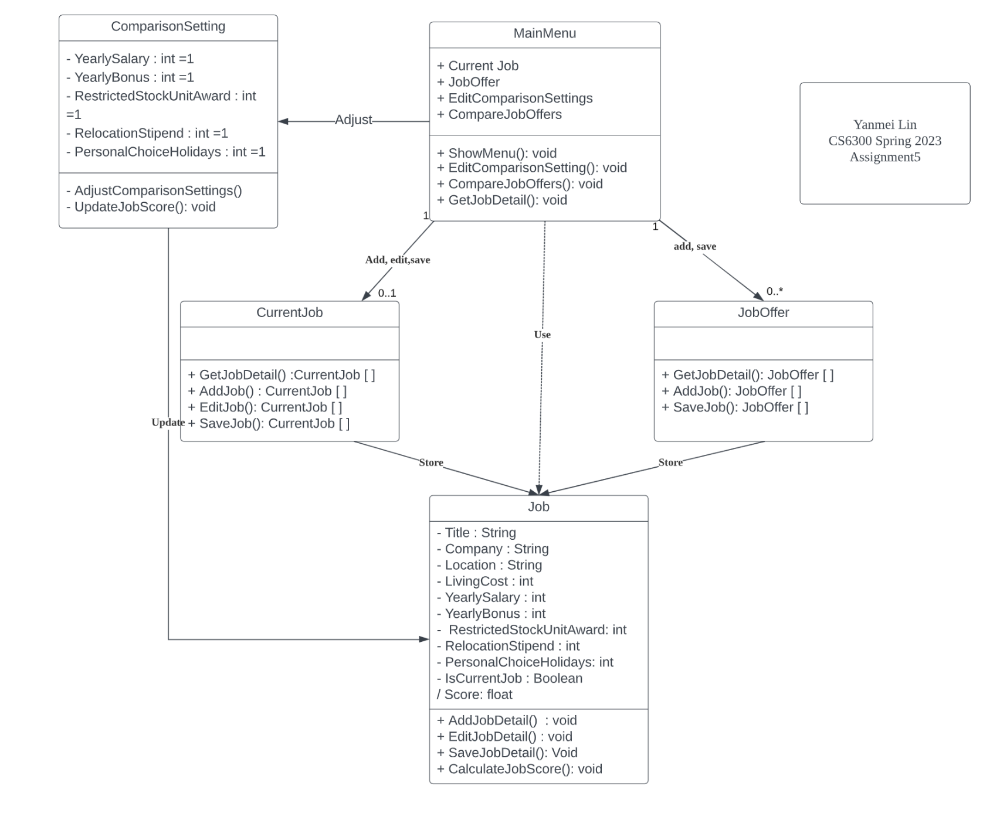

# Design 1 -jcochrane7

## Pros
Design 1 had many pros that we identified. The basic idea that it was simple and concise made it easy to understand how the project requirements were addressed.  The concept of private verses public attributes was prevalent in this design. All attributes in the design were private which made sense as it pertained to the project requirements. One item that stood out with this model was the idea of limits/ranges on certain attributes. This concept was seen on jobRelocationStipend and jobPersonalHolidays of the Job class.

* Design simple and concise
* Design contains private attributes 
* Design includes range or limits of the Stipend and Holiday attributes

## Cons
In our discussion on the Job_Comparer class, our team decided that it was probably unnecessary based on our understanding of the current project requirements.  This may change as the requirements are further refined and explained. Instead of the Job_Comparer being the entry point for the design, the team thought the MainMenu class was more appropriate.  The MainMenu class sounds like it might be related to the GUI. Perhaps a name like appmanager might help make this more clear.

* Job_Comparer class is unnecessary
* Main menu would be the entry point, however it should have a different name
* Some of methods should be public rather than private

# Design 2 -lwang443

## Pros
The approach of design 2 implemented the idea of class inheritance.  The CurrentJob and JobOffer classes were created to show the differences between the current job and the job offers.  Both classes inherited from Job, which contained all of the attributes for both classes. Inheritance was something that made the model more elaborate by showing how these classes were different.  Another area where this model shined was in showing the cardinatlity between classes.  For example, the cardinality between Main and Current job was 1 to 0..1.  This identified that a person could have 0 or 1 job, and no more. Finally, this model showed the dependency between Job and ComparisonSettings.  The idea here was that a Job uses the ComparisonSettings in the computeJobScore() method.

* Job Offer and Current Job are individual classes, split out to show the differences between current job and job offers. 
* The cardinality between classes is spelled out. 
* Use dependency between Job and Comparison Setting identifies a dependancy 

## Cons
Our team thought that the overall design contained the necessary attributes. However, all attributes were set to public access. Our group's general concensus that they should be set to private, and the attributes should be set with getter and setter methods.  One requirement that was missing was that the model was missing the functionality to list job offers. There was a compareJob() method for two jobs; however, there was no way to show a list of jobs sorted in order of the score. Finally, there was the discussion of isCurrentJob on the Job class.  In discussing this item, the general concensus was that the attribute was redundant in that the current job would be identified b the CurrentJob class.

* List job offers method is missing. There is no way to list job offers
* All attributes are set to public
* Attribute isCurrentJob is redundant in that CurrentJob is split out from JobOffer

# Design 3 -ylin697

## Pros
One thing that stood out with this model was that it had a label which showed the auther, class, and assignment. This gave the diagram a finished looked.  Design 3 was similar to design 2, implementing class inheritance for CurrentJob and JobOffer. This makes it easy to distinguish between the CurrentJob and JobOffer classes. In addition, there were uses of private and public accessors on the class attributes. One area of discussion among the team was if the score for each job offer should be calculated one time and stored, or if it should be recalculated each time a job offer list is displayed. This design took the approach of store the score in the Job class. 

* Diagram is labeled with author's name
* Inheritance was used to show the difference between the current job and job offer
* Use of private and public modifiers 
* Descriptive names showing the relationships between classes
* UpdateJobScore() method allows for one time calculation of Job score

## Cons
The MainMenu class was the entry point to the system.  However, the class name seemed misleading in that it might be mistaken for a GUI implementation class. In addition, some of the attributes in the MainMenu class should probably be methods, such as EditComparisonSettings and CompareJobOffers. Finally, the relationship between CurrentJob/JobOffer and Job is labeled as "store".  A better name here might be "is a type of" to represent that CurrentJob and JobOffer are a "type of" Job. 

* MainMenu class could be renamed to distinguish it from GUI implementation classes
* The store relationship between CurrentJob/JobOffer and Job could be changed to "is a type of". 
* Some attributes need to be reclassified as methods on the entry point class.

# Design 4 -viglehart3

## Pros 
Similar to design 3, model 4 cotained a label identifying the auther, system, and last updated. The last updated value helps track the version of the class model.  In this design, the score was being calculated on "just in time", meaning that it would be calculated exactly when the jobs are being sorted and compared. This would alleviate issues with a stale score that could happen as a result of the score needing to be kept up to date from multiple areas in the system. This would occur during the listJobs() method of SystemMgr. This design did not implement inheritance to identify the current job. Rather, an attribute on the Job class would identify which Job was the current Job.

* Labeling the model with model
* Private attributes and public methods on classes seemed to be appropriate according the the requirements 
* The design was simple and concise, it looked easy to implement, meanwhile satisfying project requirements

## Cons
The label to identify the model could be updated to include a version number.  The score is calculated in the listJobs() method; however it is never returned to the caller. The requirements of the project to do not specify that the score should be returned to the caller.  Our team thought maybe this might be a requirement that has not been identified during intial project discussion.

* The label could include a version nbr to better track the version of the class diagram. This would be helpful when the model is printed.
* There is no place to store the score and return it to the caller - not a requirement of the project, yet might be necessary.

# Team Design

Commonalities that were found between designs shared by the team were that classes were made for the entry point and job. Through the entry point, it would be where the user could create new job offers, update their current job, update the comparison weight and compare jobs. Each of the proposed designs also had a job class that contained the required attributes of what was required of a job (e.g., Title, location) Some difference found during discussion were the uses of public and private methods, and the number of job classes. After our discussion, we all agreed to begin with design 4 and incorporate certain design ideas from the other designs. We realize that there may be changes that we need to incorporate, based on feedback from the user.

Our team approach was to future proof our design to make it adaptable. To do this, we wanted to make sure that we had a good up-front design. To allow for this, we took the best aspects of each design and pulled them together into one.  There was much discussion on what the best approach was for multiple aspects of the project. To help with project collaboration, we had multiple people lead project design discussion. This allowed for diverse discussion among team members and invited participation from everyone. 

The design we chose is based on the requirements as we understand them today. If the requirements change, or further information is uncovered during future discussions, it may be necessary to change our design. Our team was careful to re-read the requirements and watch the discussion forum for further information that we may have missed in our individual designs.

Score calculation - at this point, we decided to calculate the score when the job list was being compiled. That way, the system would always display the job list using the latest comparison options, without the concern for stale data being stored in the score data item.  Furthermore, the overhead of calculating the score multiple times paled in comparison to calculating the score from multiple places.

# Summary

Our group discussions played a crucial role in enhancing our class UML diagram, as each team member contributed their unique perspectives and design ideas. We took turns to present our individual designs and identify areas of overlap or amibuity. During the process, team members helped each other deepen their understanding of the requirements and pay attention to details. This included ensuring that all necessary attributes and methods being included without any extras or omissions, selecting the appropriate access modifier (i.e., public or private), choosing self-explanatory and unambiguous names for attribute and methods, and deciding the correct data types and ranges.

These discussions were always conducted in a supportive and respectful manner, and this process allowed our team to arrive at an improved and comprehensive UML design, which could suitably realize all system requirements in a clear and concise manner.

In summary, there were many lessons learned during this assignment. Collaboration and open discussion is important to have a robust design that is adaptable to future enhancements. To promote open discussion and participation, our team rotated the person taking notes and facilating the meeting. This seemed to work well and we are likely to employ this idea in the future. There are many nuances of meeting online rather than face-to-face. It is hard to see if people are understanding discussion if you can't see their response face-to-face. Our team addressed this by making sure everyone was participating and had a chance to get involved.

It was challenging to decide on the best design to address certain requirements. That is where the team tried to keep our design simple, yet effective in matching overall system requirements. One case in point is in the calculation of the score. Our team debated on the best way to approach calculations of the score. Should the score be housed in a class or should it be calculated in real time? We discussed this topic in detail and then eventally the team came to a general concensus. 
