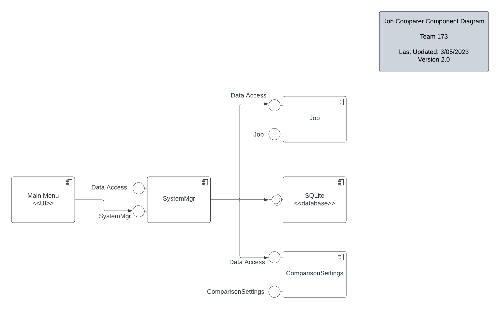
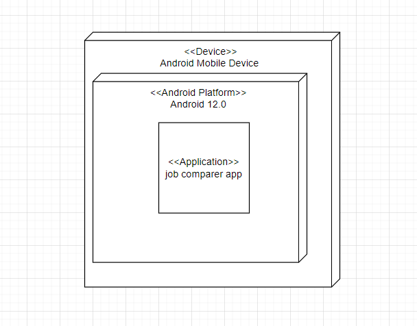
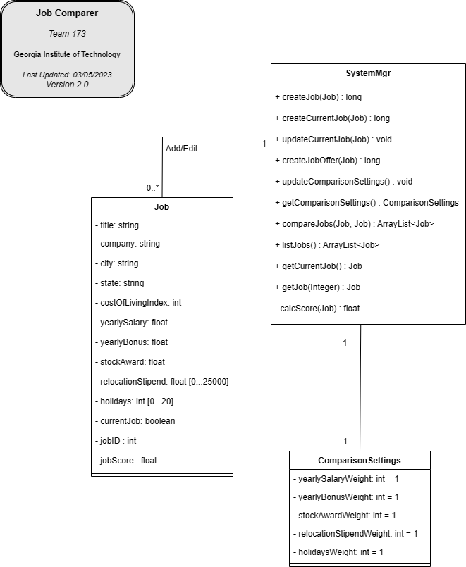
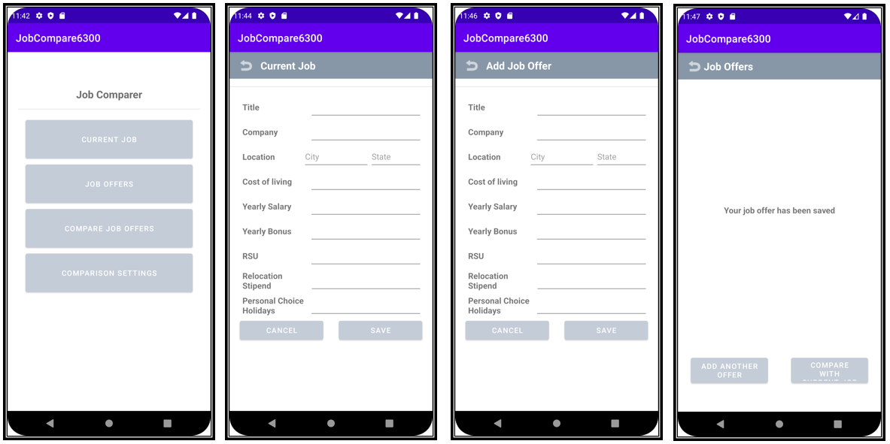
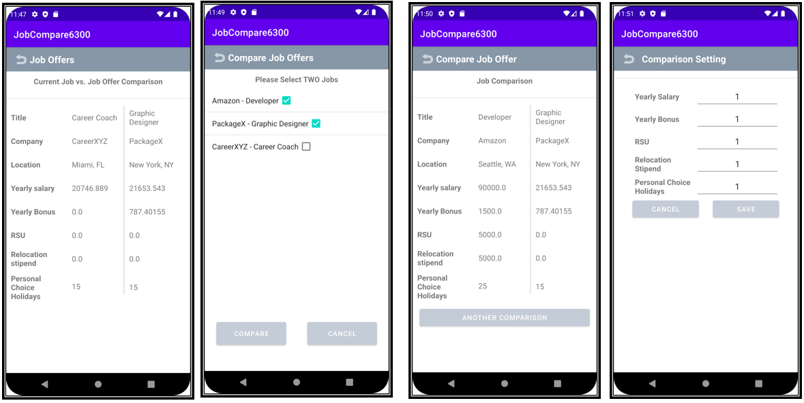

# Design Document

**Author**: Team 173

**Last Update**: 3/05/2023

**Version**: 2.0

## 1 Design Considerations

The Job Comparer app is intended for use on an a mobile Android-based device.  Therefore, we have the following design considerations.

### 1.1 Assumptions

* The Job Comparer app will be for single user use only (no login or identity management necessary)
* The user will provide all necessary job offer data and will enter data via text input in the app (i.e. upon first login the system will be a "blank slate")
* The Job Comparer app will be operated in an "offline" environment (no requirement for internet connectivity)
* All data will persist across sessions and will be stored locally (SQLite)
* Default Comparison Settings will be set to 1
* There is no requirement for the Job Comparer app to operate in a non-Android environment now or in the future
* When entering a job offer all fields will be required (no blank fields allowed)
* This application will be built to run on a typical Android 12 device

### 1.2 Constraints

Given the Job Comparer app will be installed and used on a mobile Android device, we expect the following constraints:

* Performance will be limited due to mobile device limitations
* No online connectivity (beyond scope)
* All data will be retrieved and stored locally on the device using SQLite

### 1.3 System Environment

* Hardware: Android mobile device (phone or tablet)
* Operating System: Android 12
* API level: 31 for compileSdk, midSdk, and targetSdk

## 2 Architectural Design

Overall, the Job Comparer app has a fairly simple architectural design with only three classes and interaction with a local SQLite database.  See component and deployment diagrams below.

### 2.1 Component Diagram

Description:
1. Main Menu - The Main Menu is a GUI component and will be the entry point into the system.
1. SystemMgr - SystemMgr provides the interface to the main functionality of the app.  For instance, this is where the logic to compare jobs, list jobs, create a job offer, and enter/edit a current job lives in publicly accessible methods.  SystemMgr provides no state.
1. Job - Job is the primary state object.  Job objects will store job offer data (i.e. Job Title, Company, Salary, etc.).
1. ComparisonSettings - ComparisonSettings is a simple component that will store the salary, bonus, relocation stipend, stock award, and holidy weights that will be used in job scoring.
1. SQLite - The SQLite component is the database layer that will provide the required persistence between sessions by storing the job offer and comparison settings data.

### 2.2 Deployment Diagram

The deployment diagram is simple.  The Job Comparer app will operate on an Android Mobile Device using the Android 12.0 platform.

## 3 Low-Level Design

### 3.1 Class Diagram

### 3.2 Other Diagrams

We did not think it necessary to include any other diagrams.

## 4 User Interface Design

