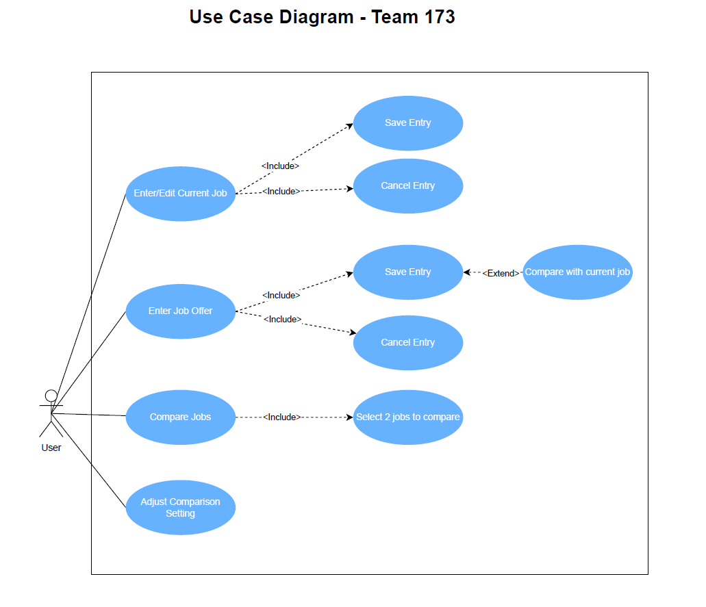

# Use Case Model

Use case diagram demonstrates the different ways that a user can interact with our ComJob system.

**Author**: Team 173

## 1 Use Case Diagram

*This section contains a use case diagram with all the actors and use cases for the system, suitably connected.*

## 2 Use Case Descriptions

**Use Case #1** - Enter/Edit Current Job
- Requirements: This use case allows the user to enter the current job details.
- Pre-conditions: There are no pre-conditions; the user has permission to use this feature.
- Post-conditions: There are no blank or empty values for every job details attribute.
- Scenarios:
    1. The user clicks the "Enter/Edit Current Job Details" button to go to the Current Job Details screen. 
  2. If the current job exists, retrieve the current job details and show them in the Current Job Details screen. 
  3. If the current job doesn't exist, show the Current Job Details with an empty table. 
  4. The user needs to enter all necessary information for the current job. 
  5. The user clicks the buttons for different decisions, both options will return to the main menu:
     1. Click "Save" to save job details into the database. 
     2. Click "Cancel" to exit to MainMenu without saving.

**Use Case #2** - Enter Job Offer
- Requirements: This use case allows the user to enter all the details of a new job offer.
- Pre-conditions: There are no pre-conditions; the user has permission to use this feature.
- Post-conditions: There are no blank or empty values for every job details attribute.
- Scenarios:
  1. The user clicks the "Current Job Details" button to go to the Current Job Details screen.
  2. The user needs to enter all necessary information for the job offer (same as current job).
  3. The user clicks buttons for different decisions:
     1. Click "Save" to save job details into the database.
     2. Click "Cancel" to exit to MainMenu without saving.
  4. After pressing the ‘save’ button, the user is presented with the following options:
     1. The user can press the ‘Add Another Offer’ button to enter a new offer.
     2. The user can press the ‘Compare Offer with Current Job’ button (only if the current job exists).
     3. The user can press the ‘Back to Main Menu’ button to return to the menu.

**Use Case #3** - Compare Job Offers
- Requirements: This use case allows the user to select two valid jobs to compare.
- Pre-conditions: Either one of the following conditions must be met:
  - (1) at least one job offer, if current job exist, or 
  - (2) at least two job offer, if current job doesn't exist.
- Post-conditions: Two jobs have been selected for comparing.
- Scenarios:
  1. The user clicks the "Compare Job Offers" button to activate the compare job offers method. 
  2. A list of jobs' Title and Company shows up; jobs are ranked from best to worst based on the score calculated (* refer to use case #4). 
  3. The user selects two jobs from the job list and presses the ‘Compare’ button to proceed or presses the ‘Cancel’ button to return to the menu.
  4. If the ‘Compare’ button is pressed, the user is taken to the ‘Job Comparison’ screen to see side by side comparison

**Use Case #4** - Adjust Comparison Settings
- Requirements: This use case allows the user to adjust comparison setting by assign integer weight.
- Pre-conditions: There are no pre-conditions; the user has permission to use this feature.
- Post-conditions: Weights are stored. If no weights are assigned, all factors are considered equal.
- Scenarios:
  1. The user clicks ‘Comparison Settings’ button from the Main Menu 
  2. The user adjusts the comparison settings. Default value for each factor is set to 1, new values need to be greater or equal to 1.
  3. The user is provided a choice to either Save or Cancel the settings.
